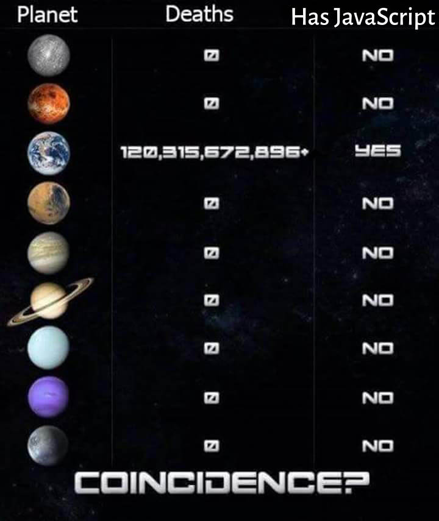
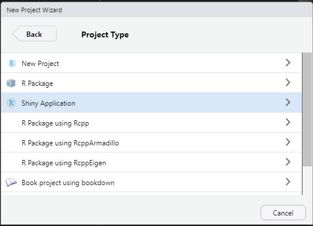
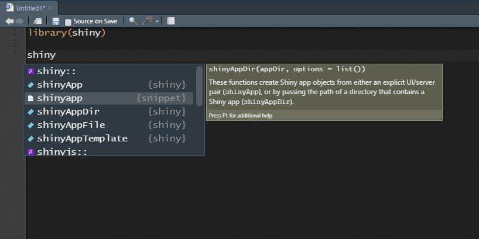
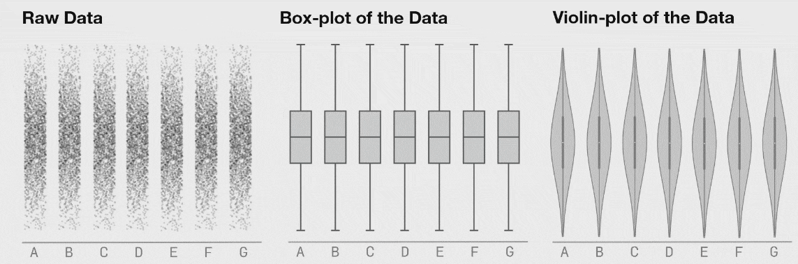
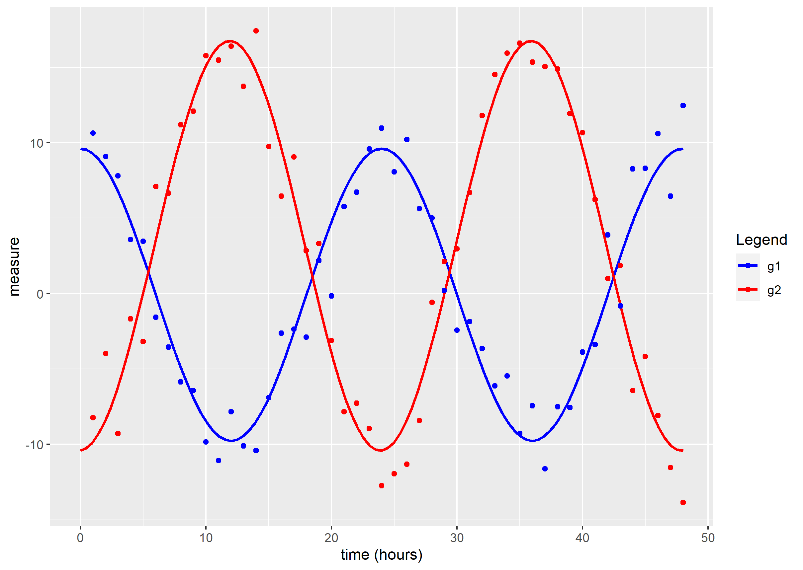
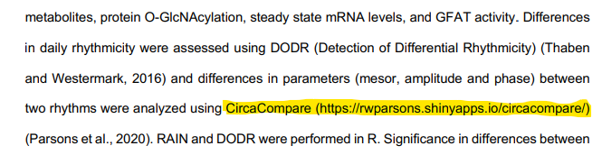
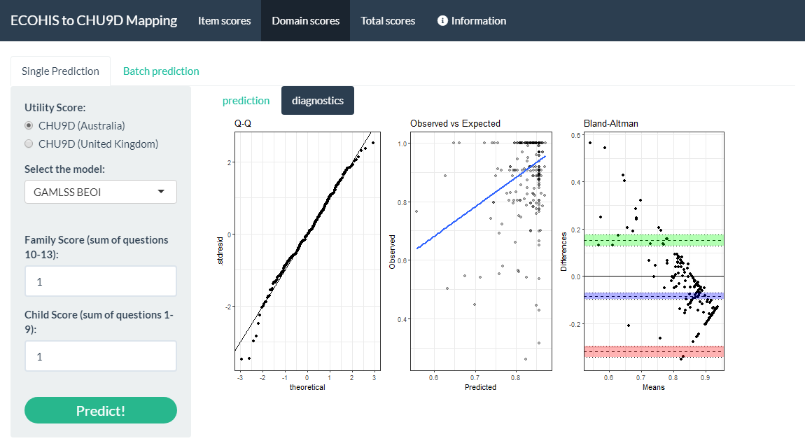
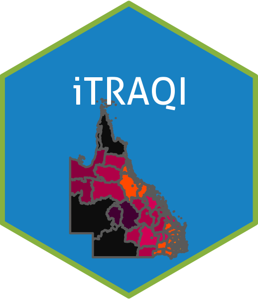

```{r setup, include=FALSE}
knitr::opts_chunk$set(echo = TRUE, message=F)
```

<style>
body slides > slide {
  height: 800px;
  width: 900px;
  margin-top: -400px;    /* half of height */
}
iframe shiny-frame {
  height: 1200px;
  width: 100%;
}
p {
  margin-top: 0px ;
  margin-bottom: 0px ; 
  height: 150%;
  width: 100%;
} 
div.footnotes {
  position: absolute;
  bottom: 0;
  margin-bottom: 10px;
  width: 80%;
  font-size: 0.6em;
}
.center {
  display: block;
  margin-left: auto;
  margin-right: auto;
}
.alignRight {
    float: right;
}
</style>

<script src="https://ajax.googleapis.com/ajax/libs/jquery/3.1.1/jquery.min.js"></script>
<script>
$(document).ready(function() {
  $('slide:not(.backdrop):not(.title-slide)').append('<div class=\"footnotes\">');

  $('footnote').each(function(index) {
    var text  = $(this).html();
    var fnNum = (index+1).toString();
    $(this).html(fnNum.sup());

    var footnote   = fnNum + '. ' + text + '<br/>';
    var oldContent = $(this).parents('slide').children('div.footnotes').html();
    var newContent = oldContent + footnote;
    $(this).parents('slide').children('div.footnotes').html(newContent);
  });
});
</script>

## Outline

- Brief intro to the elements of shiny
- How shiny can help make your work more accessible
- Examples

>- 

## shiny

```{r, echo=F}
library(shiny)
library(leaflet)

towns <- read.csv("input/QLD_locations_with_RSQ_times_20220518.csv")

ui <- fluidPage(
  tags$head(
    tags$style(HTML("
      div.full-page {
        position: fixed;
        top: 0;
        left: 0;
        right: 0;
        bottom: 0;
        overflow: hidden;
        padding: 0;
      }
      "
    ))
  ),
  div(
    class="full-page",
    leafletOutput('map', height="100%", width="100%"),
    absolutePanel(
      top=75, left=10,
      class = "panel panel-default",
      selectInput(
        'town_name', 'Town Name',    
        choices = c('None', sort(towns$location)),
        selected = "None"
      )
    )
  )
)

server <- function(input, output, session) {
  output$map <- renderLeaflet({
    leaflet() %>%
      addTiles() %>%
      addCircleMarkers(
        lng=towns$x,
        lat=towns$y,
        popup=glue::glue("<b>Location:</b> {towns$location}"),
        radius=2, 
        fillOpacity=0,
        group="Towns"
      )
  })
  
  observe({
    if(input$town_name!="None") {
      town_row <- towns[towns$location==input$town_name, ]
      leafletProxy("map") %>%
        flyTo(lng=town_row$x, lat=town_row$y, zoom=10)
    } else {
      leafletProxy("map") %>%
        flyToBounds(
          lng1 = 137.725724, lat1 = -28.903687,
          lng2 = 151.677076, lat2 = -10.772608
        )
    }
  })
}
shinyApp(ui, server)

```

## shiny

{.alignRight height=500}

- Framework for making web apps with R code
- Relies on a shiny server that runs R code behind the scenes (CDS has a shinyapps.io plan!)
- Means that you can make web apps with little-to-no knowledge of HTML, CSS or JavaScript (unless you want to make things highly personalised)
- Uses reactive programming so that the outputs react the user's inputs


## Making a shiny app {.smaller}
- The **easiest** way to make a shiny app is to make a new R project from RStudio

{.center height=225px}

- The next easiest way is to create a new R script, call is `app.R`, and create your app starting from a snippet

{.center height=190px}

## Components {.smaller}

A shiny app is made up of two parts: the `ui` that defines how it looks and the `server` which defines how it works.

```{r, eval=FALSE}

library(shiny)
ui <- fluidPage(
  
)
server <- function(input, output, session) {
  
}

shinyApp(ui, server)
```

---

Content that is added to the UI displays to the user.

```{r}
library(shiny)
ui <- fluidPage(
  "Hello, CDS!"
)

server <- function(input, output, session) {
  
}
shinyApp(ui, server)

```

---

Outputs which are rendered on the server side can be displayed by the ui.

You have to tell the ui what sort of object is being rendered:

- `plotOutput()` ~ `renderPlot()`
- `tableOutput()` ~ `renderTable()`
- `leafletOutput()` ~ `renderLeaflet()`

Many of these are in `{shiny}` but some will be in their respective packages (`{leaflet}` for the last one) 

```{r, eval=FALSE}
ui <- fluidPage(
  plotOutput("plot")
)
server <- function(input, output, session) {
  output$plot <- renderPlot({
    hist(rnorm(n=20))
  })
}
shinyApp(ui, server)
```

---
 
```{r}
ui <- fluidPage(
  plotOutput("plot")
)
server <- function(input, output, session) {
  output$plot <- renderPlot({
    hist(rnorm(n=20))
  })
}
shinyApp(ui, server)
```

## Adding controls

```{r, eval=FALSE}
ui <- fluidPage(
  numericInput("sample_size", "Select sample size:", value=20),
  plotOutput("plot")
)

server <- function(input, output, session) {
  output$plot <- renderPlot({
    hist(rnorm(n=input$sample_size))
  })
}

shinyApp(ui, server)
```

---

<div class="notes">
```
ui <- fluidPage(
  numericInput(
    "sample_size", 
    "Select sample size:", 
    value=20
  ),
  plotOutput("plot")
)

server <- function(input, output, session) {
  output$plot <- renderPlot({
    hist(rnorm(n=input$sample_size))
  })
}

shinyApp(ui, server)
```
</div>

```{r, echo=FALSE}
ui <- fluidPage(
  numericInput("sample_size", "Select sample size:", value=20),
  plotOutput("plot")
)

server <- function(input, output, session) {
  output$plot <- renderPlot({
    hist(rnorm(n=input$sample_size))
  })
}

shinyApp(ui, server)
```


## There are lots of ways that you can get inputs from your users

```{r}
funs <- ls("package:shiny")
funs[grepl("input$", tolower(funs)) & !grepl("update", tolower(funs))]
```

(Also see `{shinyWidgets}` for some fun input options)

---

```{r}
ui <- fluidPage(
  splitLayout(dateInput("dateInput", "date:"), fileInput("fileInput", "file:")),
  checkboxGroupInput('checkboxGroupInput', 'checkboxGroup:', choices=LETTERS[1:3], selected="A"),
  shinyWidgets::colorSelectorInput("colorSelectorInput", "colorSelector:", c("red", "green", "blue"), "red"),
  shinyWidgets::downloadBttn("downloadBttn")
)
server <- function(input, output, session) {
}
shinyApp(ui, server)
```

## There are also lots of ways to show outputs to your users

```{r}
funs <- ls("package:shiny")
funs[grepl("output$", tolower(funs))]
```

## shiny apps can make your work more accessible

- For new methods and models, R packages can work well for regular useRs but not necessarily for others
- Some results are complex and hard to visualise in one **best** way

{width=320px}
{width=650px}

## shiny apps can make your work more accessible

### `{circacompare}` {.smaller}

App that allows users to upload their data and fit a nonlinear model (using `nls()`) that estimates differences in circadian characteristics between two groups.

<https://rwparsons.shinyapps.io/circacompare/>

{.center height=300px}

## `{circacompare}` {.smaller}

Most use the [R package](https://cran.r-project.org/web/packages/circacompare/index.html) but sometimes, they will say that they specifically used the shiny app.<footnote>Liu, Xianhui, et al. "Hexosamine biosynthetic pathway integrates circadian and metabolic signals to regulate daily rhythms in protein O-linked N-acetylglucosaminylation." *bioRxiv* (2020).</footnote>




## `{circacompare}` <115 lines of code

<div style="margin-left:-50px; margin-top:-50px; width:100%; height:1200px">
```{r, echo=FALSE, fig.height=24}
library(shiny)
library(circacompare)
library(tidyverse)
library(kableExtra)

ui <- fluidPage(
  sidebarLayout(
    sidebarPanel(
      fileInput("file1", "Choose CSV File",
        accept = c(
          "text/csv",
          "text/comma-separated-values,text/plain",
          ".csv"
        )
      ),
      tags$br(),
      uiOutput("time_selecter"),
      uiOutput("group_selecter"),
      uiOutput("outcome_selecter"),
      tags$br(),
      uiOutput("ui.action")
    ),
    mainPanel(
      plotOutput("plot"),
      tableOutput("contents")
    )
  )
)

server <- function(input, output, session) {
  filedata <- reactive({
    infile <- input$file1
    if (is.null(infile)) {
      return(NULL)
    }
    read.csv(infile$datapath)
  })

  cols <- reactive({
    df <- filedata()
    if (is.null(df)) {
      return(NULL)
    } else {
      return(names(df))
    }
  })

  output$time_selecter <- renderUI({
    if (is.null(cols())) {
      return(NULL)
    }
    selectInput("time", "Select the TIME (INDEPENDENT) variable from:", cols())
  })

  output$group_selecter <- renderUI({
    if (is.null(cols())) {
      return(NULL)
    }
    selectInput("group", "Select the GROUPING variable from:", cols())
  })

  output$outcome_selecter <- renderUI({
    if (is.null(cols())) {
      return(NULL)
    }
    selectInput("outcome", "Select the OUTCOME (DEPENDENT) variable from:", cols())
  })

  output$ui.action <- renderUI({
    if (is.null(input$file1)) {
      return()
    }
    actionButton("action", "Run")
  })

  observeEvent(input$action, {
    isolate({
      df <- filedata()
      if (is.null(df)) {
        return(NULL)
      }
      set.seed(42)
      cc_obj <- circacompare(
        df,
        col_time = input$time,
        col_group = input$group,
        col_outcome = input$outcome
      )
    })

    output$contents <- renderText({
      if (class(cc_obj) != "list") {
        return(cc_obj)
      }
      cc_obj$summary %>%
        mutate(
          value = as.character(value),
          value = ifelse(value == 1 & parameter == "Both groups were rhythmic", TRUE, value)
        ) %>%
        kable(format = "html", escape = F) %>%
        kable_styling("striped", full_width = F)
    })

    output$plot <- renderPlot({
      if (class(cc_obj) != "list") {
        return(NULL)
      }
      cc_obj$plot
    })
  })
}

shinyApp(ui = ui, server = server, options=list(height="100vh"))
```
</div>

## shiny apps can make your work more accessible

### ECOHIS to CHU9D mapping

- Usually this type of work has a linear model and equation in paper
- But this project had many models and variable levels of performance/appropriateness
- App gives the user the ability to get predictions with new data and inspect diagnostic plots

---

{width=100%}

## shiny apps can make your work more accessible

### iTRAQI {width=170px align="right"}

This app visualises inequity in access to traumatic brain injury care across QLD.

<https://access.healthequity.link/>

{class="center" width=75%}


## Making an interactive map


## Resources

<table style="width:65%">
    <tr>
        <td valign="middle" style="font-size:20px"><https://rwparsons.github.io/interactive-maps/></td>
        <td valign="top"></td>
    </tr>
    <tr>
        <td valign="middle"><a href='https://mastering-shiny.org/'></a></td>
        <td valign="middle"><a href='https://engineering-shiny.org/'></a></td>
    </tr>
</table>


## Thank you

{width=30%}
{width=40%}

{width=30 align="left"} @Rex_Parsons8


{width=30px align="left"} @RWParsons

{width=30px align="left"} http://rwparsons.github.io/

