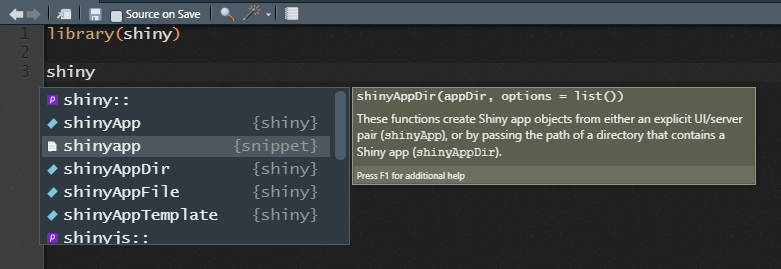

```{r setup, include=FALSE}
knitr::opts_chunk$set(echo = TRUE, message=F)
```

<style>
div.footnotes {
  position: absolute;
  bottom: 0;
  margin-bottom: 10px;
  width: 80%;
  font-size: 0.6em;
}
.center {
  display: block;
  margin-left: auto;
  margin-right: auto;
  width: 50%;
}
</style>

<script src="https://ajax.googleapis.com/ajax/libs/jquery/3.1.1/jquery.min.js"></script>
<script>
$(document).ready(function() {
  $('slide:not(.backdrop):not(.title-slide)').append('<div class=\"footnotes\">');

  $('footnote').each(function(index) {
    var text  = $(this).html();
    var fnNum = (index+1).toString();
    $(this).html(fnNum.sup());

    var footnote   = fnNum + '. ' + text + '<br/>';
    var oldContent = $(this).parents('slide').children('div.footnotes').html();
    var newContent = oldContent + footnote;
    $(this).parents('slide').children('div.footnotes').html(newContent);
  });
});
</script>

## Outline

- Brief intro to the elements of shiny
- How shiny can help make your work more accessible
- Examples

## shiny

- Framework for making web apps with R code
- Relies on a shiny server that runs R code behind the scenes (CDS has a shinyapps.io plan!)
- Means that you can make web apps with little-to-no knowledge of HTML, CSS or Javascript (unless you want to make things highly personalised)
- Uses reactive programming so that the outputs react the user's inputs


## Making a shiny app {.smaller}
- The **easiest** way to make a shiny app is to make a new R project from RStudio

{height=200px}

- The next easiest way is to create a new R script, call is `app.R`, and create your app starting from a snippet

{height=200px}

## Components {.smaller}

A shiny app is made up of two parts: the `ui` that defines how it looks and the `server` which defines how it works.

```{r, eval=FALSE}

library(shiny)
ui <- fluidPage(
  
)
server <- function(input, output, session) {
  
}

shinyApp(ui, server)
```

---

Content that is added to the UI displays to the user.

```{r}
library(shiny)
ui <- fluidPage(
  "Hello, CDS!"
)

server <- function(input, output, session) {
  
}
shinyApp(ui, server)

```

---

Outputs which are rendered on the server side can be displayed by the ui.

You have to tell the ui what sort of object is being rendered:

- `plotOutput()` ~ `renderPlot()`
- `tableOutput()` ~ `renderTable()`
- `leafletOutput()` ~ `renderLeaflet()`

Many of these are in `{shiny}` but some will be in their respective packages (`{leaflet}` for the last one) 

```{r, eval=FALSE}
ui <- fluidPage(
  plotOutput("plot")
)
server <- function(input, output, session) {
  output$plot <- renderPlot({
    hist(rnorm(n=20))
  })
}
shinyApp(ui, server)
```

---
 
```{r}
ui <- fluidPage(
  plotOutput("plot")
)
server <- function(input, output, session) {
  output$plot <- renderPlot({
    hist(rnorm(n=20))
  })
}
shinyApp(ui, server)
```

## Adding controls

```{r, eval=FALSE}
ui <- fluidPage(
  numericInput("sample_size", "Select sample size:", value=20),
  plotOutput("plot")
)

server <- function(input, output, session) {
  output$plot <- renderPlot({
    hist(rnorm(n=input$sample_size))
  })
}

shinyApp(ui, server)
```

---


```{r, echo=FALSE}
ui <- fluidPage(
  numericInput("sample_size", "Select sample size:", value=20),
  plotOutput("plot")
)

server <- function(input, output, session) {
  output$plot <- renderPlot({
    hist(rnorm(n=input$sample_size))
  })
}

shinyApp(ui, server)
```


## There are lots of ways that you can get inputs from your users

```{r}
funs <- ls("package:shiny")
funs[grepl("input$", tolower(funs)) & !grepl("update", tolower(funs))]
```

(Also see `{shinyWidgets}` for some fun input options)

---

```{r}
ui <- fluidPage(
  checkboxGroupInput('checkboxGroupInput', 'checkboxGroup:', choices=LETTERS[1:3], selected="A"),
  splitLayout(dateInput("dateInput", "date:"), fileInput("fileInput", "file:")),
  shinyWidgets::colorSelectorInput("colorSelectorInput", "colorSelector:", c("red", "green", "blue"), "red"),
  shinyWidgets::downloadBttn("downloadBttn")
)
server <- function(input, output, session) {
}
shinyApp(ui, server)
```

## shiny apps can make your work more accessible

- For new methods and models, R packages can work well for regular useRs but not necessarily others
- Some results are complex and visualise in one **best** way

{width=320px}
{width=650px}

## shiny maps can make your work more accessible

### `{circacompare}` {.smaller}

App that allows users to upload their data and fit a nonlinear model (using `nls()`) that estimates differences in circadian characteristics between two groups.

<https://rwparsons.shinyapps.io/circacompare/>

Most use the [R package](https://cran.r-project.org/web/packages/circacompare/index.html) but sometimes, they will say that they specifically used the shiny app.<footnote>Liu, Xianhui, et al. "Hexosamine biosynthetic pathway integrates circadian and metabolic signals to regulate daily rhythms in protein O-linked N-acetylglucosaminylation." *bioRxiv* (2020).</footnote>


## shiny maps can make your work more accessible

### ECOHIS to CHU9D mapping

- Usually this type of work has a linear model and equation in paper
- But this project had many models and variable levels of performance/appropriateness
- App gives the user the ability to get predictions with new data and inspect diagnostic plots

---

{width=100%}

## shiny maps can make your work more accessible

### iTRAQI {width=170px align="right"}

This app visualises inequity in access to traumatic brain injury care across QLD.

<https://access.healthequity.link/>

{class="center"}

## Resources

<a href='https://mastering-shiny.org/'></a>
<br>
<br>
<br>
{width=150px}

<https://rwparsons.github.io/interactive-maps/> 


## Thank you

{width=30%}
{width=40%}

{width=30 align="left"} @Rex_Parsons8


{width=30px align="left"}   @RWParsons


<br>
<br>
<br>


Slides were made using `ioslides_presentation` in RMarkdown

